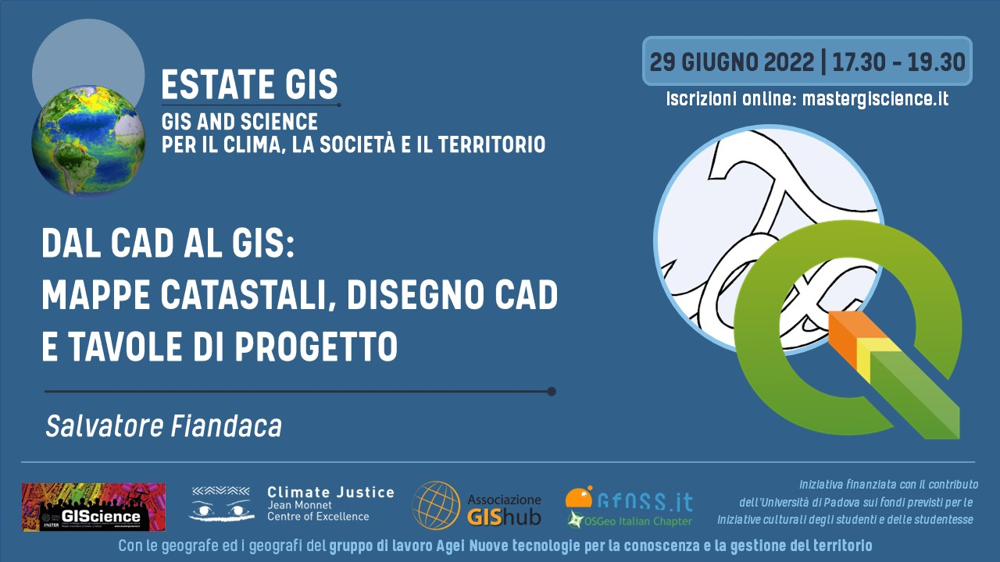

# workshop estate gis 2023

Scopriamo le potenzialità del Print Layout di QGIS.

## Titolo

**TITOLO**:   Scopriamo le potenzialità del Print Layout di QGIS.

**DESCRIZIONE**:   Il compositore di stampe di QGIS ha delle potenzialità nascoste enormi, permette di relaizzare semplice layout di stampe ma anche atlanti con grafici dinamici, con layout di pagine modificabili tramite espressioni e atlanti con diverse tipologia di layer di copertura. In questo workshop vedremo alcuni esempi.

---

## Relatore

- 👨‍🦲 **Totò FIANDACA**  (Membro [OpenDataSicilia](http://opendatasicilia.it/) (2014) , Membro [QGIS Italia](http://qgis.it/) (2015), Socio [GFOSS.it](https://gfoss.it/) (2017), Membro [QGIS organization](https://github.com/qgis) (2020))

## Data, luogo e durata

- 🗓 29/06/2022 con orario 🕟 17:30 🕢 19:30 
- 🌐 on-line
- ⏳ 2️⃣ ore

## Piattaforme e Software

- [ZOOM](https://zoom.us/) - per diretta web
- Windows 10 64b - come SO
- [`QGIS 3.28 LTR Firenze`](https://qgis.org/it/site/)  

## Programma