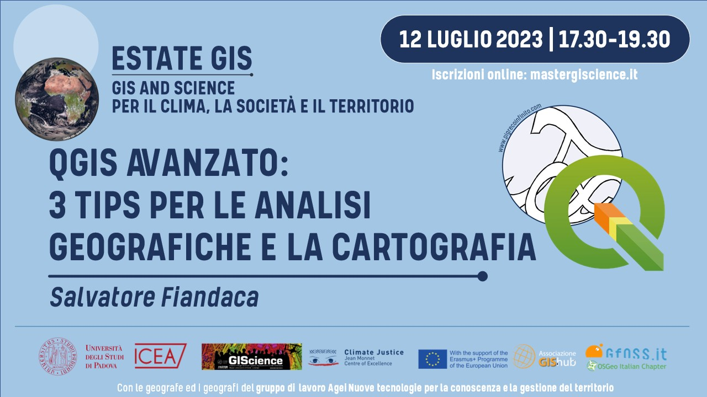
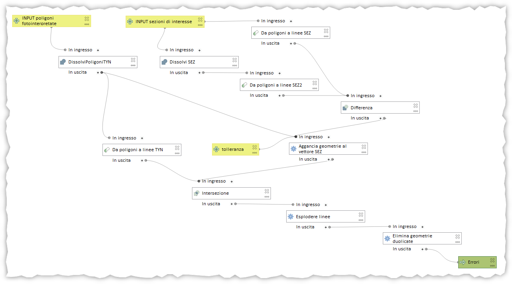
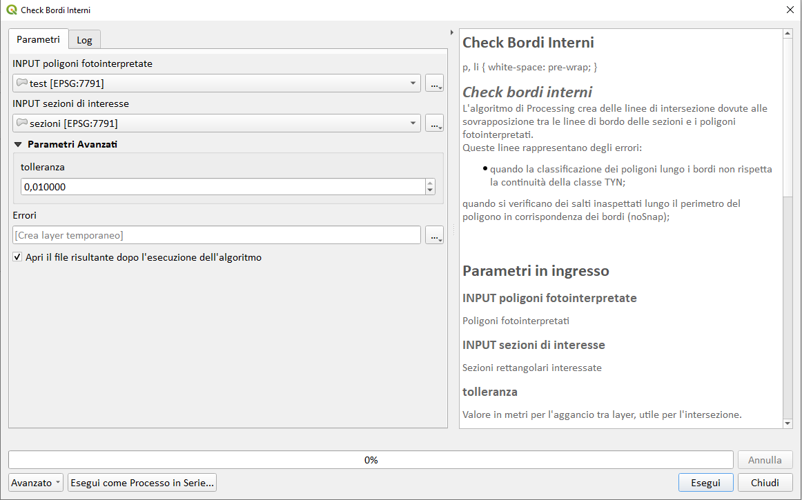
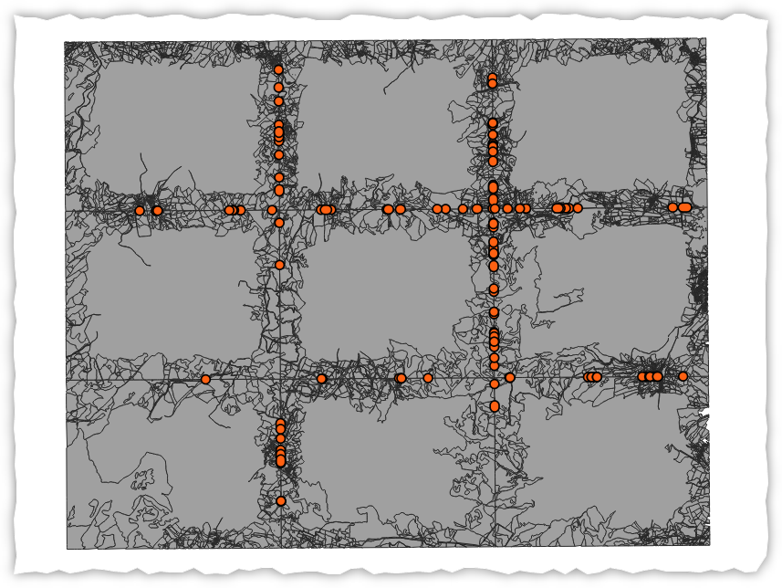
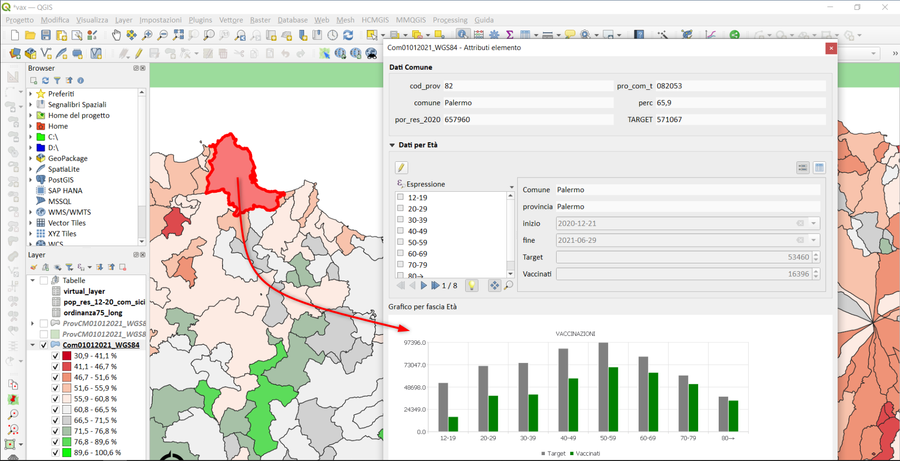
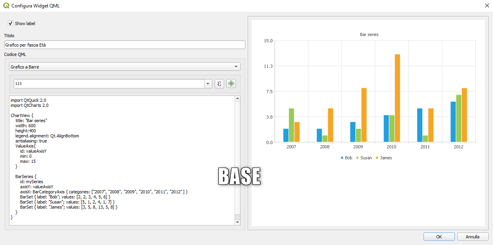
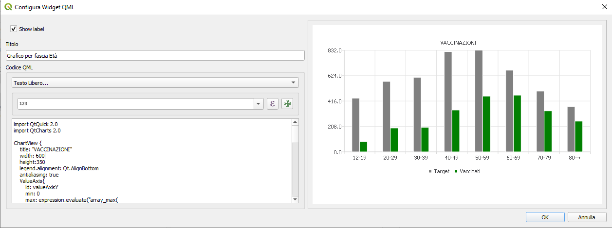
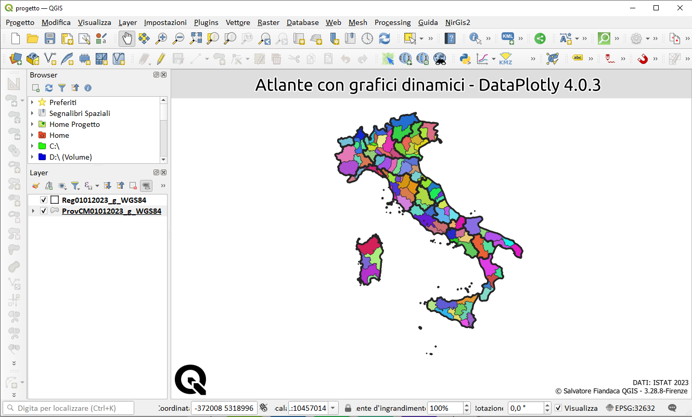
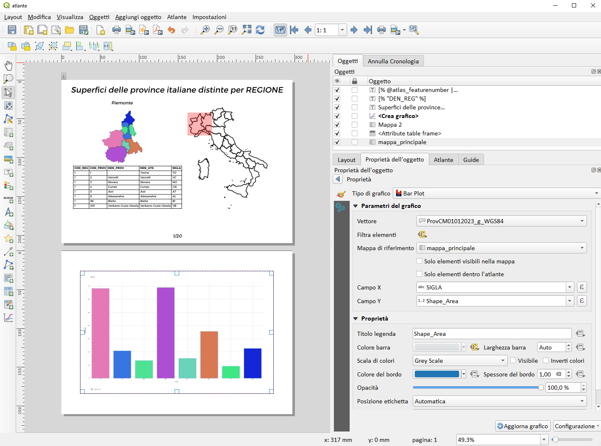

# workshop estate gis 2023

<!-- TOC -->

- [workshop estate gis 2023](#workshop-estate-gis-2023)
  - [Titolo](#titolo)
  - [Relatore](#relatore)
  - [Data, luogo e durata](#data-luogo-e-durata)
  - [Piattaforme e Software](#piattaforme-e-software)
  - [Programma](#programma)
    - [Modellatore grafico di QGIS](#modellatore-grafico-di-qgis)
      - [Che cosa è?](#che-cosa-è)
      - [Cosa fa?](#cosa-fa)
    - [WidGet QML di QGIS](#widget-qml-di-qgis)
      - [Che cosa è?](#che-cosa-è-1)
      - [cosa fa?](#cosa-fa-1)
    - [Compositore di stampe di QGIS](#compositore-di-stampe-di-qgis)
      - [Che cosa è il Print Layout di QGIS?](#che-cosa-è-il-print-layout-di-qgis)
  - [DATI e PROGETTI](#dati-e-progetti)
  - [RIFERIMENTI UTILI](#riferimenti-utili)
- [DISCLAIMER](#disclaimer)

<!-- /TOC -->

## Titolo

**TITOLO**: <br> Scopriamo le potenzialità del Print Layout di QGIS.

**DESCRIZIONE**: <br> Hai mai utilizzato funzioni avanzate all’interno del software open source più famoso del web? Avanziamo con un flusso di lavoro completamente sviluppato in ambiente **QGIS**, che grazie allo straordinario contributo di **Salvatore Fiandaca** (_pigrecoinfinito.com_) non ha più limiti. Dal know-how di _pigrecoinfinito_, affronteremo esempi pratici su come lavorare al meglio con il _**Model builder**_, come usare il _**widget QML**_ per una gestione personalizzata dei progetti e dei dati e vedremo come lavorare con il _**compositore per layout di stampa**_ professionali.

<p align="center"><a href="https://www.facebook.com/events/267322345814499/267324065814327/?ref=newsfeed" target="_blank"></a></p>

---

[](https://github.com/pigreco/seminario-estate-gis-2020/blob/master/license)
[](https://github.com/pigreco/seminario-estate-gis-2020/commits/master)

## Relatore

- 👨‍🦲 **Totò FIANDACA** <br>(Membro [OpenDataSicilia](http://opendatasicilia.it/) (2014) , Membro [QGIS Italia](http://qgis.it/) (2015), Socio [GFOSS.it](https://gfoss.it/) (2017), Membro [QGIS organization](https://github.com/qgis) (2020))


## Data, luogo e durata

- 🗓 12/07/2023 con orario 🕟 17:30 🕢 19:30 
- 🌐 on-line
- ⏳ 2️⃣ ore

## Piattaforme e Software

- [ZOOM](https://zoom.us/) - per diretta web
- Windows 10 64b - come SO
- [`QGIS 3.28 LTR Firenze`](https://qgis.org/it/site/)  

↑ [torna su](#workshop-estate-gis-2023) ↑

## Programma

### Modellatore grafico di QGIS

[DOC QGIS](https://docs.qgis.org/3.28/en/docs/user_manual/processing/modeler.html?highlight=modeler%20builder)
#### Che cosa è?

Il modellatore grafico di QGIS è uno strumento integrato nell'interfaccia utente di QGIS che consente agli utenti di creare flussi di lavoro personalizzati in modo visuale e interattivo. Questo strumento è particolarmente utile per l'automatizzazione di processi complessi, permettendo di risparmiare tempo e aumentando l'efficienza del lavoro. continua [qui](https://poe.com/s/4Z6ce392paNJW90c7GUg)

#### Cosa fa?

Il modellatore grafico consente di creare modelli complessi utilizzando un'interfaccia semplice e facile da usare. Quando si lavora con un GIS, la maggior parte delle operazioni di analisi non sono isolate, piuttosto fanno parte di una catena di operazioni. Utilizzando il modellatore grafico, quella catena di operazioni può essere racchiusa in un singolo processo, rendendo conveniente l'esecuzione successiva con un diverso insieme di input. Indipendentemente dal numero di passaggi e dai diversi algoritmi che comporta, un modello viene eseguito come un singolo algoritmo, risparmiando tempo e fatica.



ESEMPIO

Ricerca errori lungo i bordi delle sezioni di taglio.

Contesto:<br>
Immaginare di lavorare con un team di persone per la realizzazione di una carta uso del suolo, l'area da analizzare è grande e si decide di suddividerla in sezioni più piccole. Le sezione vengono assegnate a vari operatori, alla fine della fotointerpretazione, le sezione verranno riassemblate per riottenere l'area complessiva iniziale.

INTERFACCIA PROCESSING:<br>


ERRORI:<br>


↑ [torna su](#workshop-estate-gis-2023) ↑

### WidGet QML di QGIS

- [DOC QGIS](https://docs.qgis.org/3.28/en/docs/user_manual/working_with_vector/vector_properties.html?highlight=widget%20qml#id122)
- [Blogpost](https://pigrecoinfinito.com/2021/07/15/dati-sulla-vaccinazione-in-sicilia/)
#### Che cosa è?

Per impostazione predefinita, quando fai clic su una caratteristica con lo strumento _**Identifica caratteristiche**_  o passi la tabella degli attributi alla modalità di visualizzazione modulo, QGIS visualizza un modulo base con widget predefiniti (generalmente caselle di selezione e caselle di testo — ogni campo è rappresentato su una riga dedicata dal suo label accanto al widget). Se le relazioni sono impostate sul livello, i campi dei livelli di riferimento vengono visualizzati in una cornice incorporata nella parte inferiore del modulo, seguendo la stessa struttura di base.

#### cosa fa?

Permette di creare/visualizzare grafici personalizzati di vario tipo.

ESEMPIO

Realizzare un modulo usando vari Widget tra cui il _**Widget QML**_ per visualizzare l'andamento della vaccinazione in Sicilia comune per comune.

dati di INPUT:
1. shapefile dei comuni siciliani;
2. file CSV con le ordinanze sui vaccini;

Nel progetto occorre definire una relazione di progetto tra lo shapefile e la tabella delle ordinanze che contiene i dati sulle vaccinazioni suddivise per fascia di età e per comune.



ESPRESSIONE BASE GRAFICO A BARRE:<br>

```
import QtQuick 2.0
import QtCharts 2.0

ChartView {
    title: "Bar series"
    width: 600
    height:400
    legend.alignment: Qt.AlignBottom
    antialiasing: true
    ValueAxis{
        id: valueAxisY
        min: 0
        max: 15
    }

    BarSeries {
        id: mySeries
        axisY: valueAxisY
        axisX: BarCategoryAxis { categories: ["2007", "2008", "2009", "2010", "2011", "2012" ] }
        BarSet { label: "Bob"; values: [2, 2, 3, 4, 5, 6] }
        BarSet { label: "Susan"; values: [5, 1, 2, 4, 1, 7] }
        BarSet { label: "James"; values: [3, 5, 8, 13, 5, 8] }
    }
}
```


ESPRESSIONE PERSONALIZZATA:<br>

```
import QtQuick 2.0
import QtCharts 2.0

ChartView {
    title: "VACCINAZIONI"
    width: 800
    height:350
    legend.alignment: Qt.AlignBottom
    antialiasing: true
    ValueAxis{
        id: valueAxisY
        min: 0
        max: expression.evaluate("array_max(
 relation_aggregate( 
 relation:='rel',
 aggregate:='array_agg',
 expression:=  \"Target\"))
 
")
    }

    BarSeries {
        id: mySeries
        axisY: valueAxisY
        axisX: BarCategoryAxis { categories: expression.evaluate("
 relation_aggregate( 
 relation:='rel',
 aggregate:='array_agg',
 expression:=  \"eta\")
 
")}
        BarSet { label: "Target"; color: "grey"; values: expression.evaluate("
 relation_aggregate( 
 relation:='rel',
 aggregate:='array_agg',
 expression:=  \"Target\")
 
") }
        BarSet { label: "Vaccinati"; color: "green"; values: expression.evaluate("
 relation_aggregate( 
 relation:='rel',
 aggregate:='array_agg',
 expression:=  \"Vaccinati\")
 
") }
       
    }
}
```



↑ [torna su](#workshop-estate-gis-2023) ↑

### Compositore di stampe di QGIS

- [DOC QGIS](https://docs.qgis.org/3.28/en/docs/user_manual/print_composer/overview_composer.html)
- [Blogpost](https://pigrecoinfinito.com/?s=atlante)

#### Che cosa è il Print Layout di QGIS?

risponde intelligenza artificiale:

Il Print Layout di QGIS è uno strumento che consente agli utenti di creare layout di stampa personalizzati per le mappe e gli atlanti. Questo strumento permette di creare documenti cartografici di alta qualità, che possono essere utilizzati per presentazioni, rapporti o documentazione.

Il Print Layout di QGIS utilizza un'interfaccia intuitiva e facile da usare, che consente agli utenti di aggiungere elementi grafici come mappe, legende, immagini e testo. Gli utenti possono anche personalizzare il layout di stampa, aggiungendo titoli, scale, orientamenti e layout della pagina. continua [qui](https://poe.com/s/KIrknRM9d6cVTHvEuwJm)

ESEMPIO

A partire dallo shapefile delle regioni italiane (20 regioni ISTAT 2023) e dalle relative province (107 province ISTAT 2023), creare un progetto QGIS che stampi 20 pagine, una per ogni regione, in cui sono visibili le province e il relativo grafico a barre che rappresenta una variabile provinciale.

1. importare i due shapefile in QGIS;
2. creare una relazione di progetto;
3. creare un layout di stampa;
4. creare una atlas;
5. aggiungere un grafico Bar Plot usando il plugin DataPlotly
6. Regioni URL : <https://gitlab.com/pigr3co/limiti_istat_2021/-/raw/main/Reg01012021_WGS84.geojson>
7. Province URL : <https://gitlab.com/pigr3co/limiti_istat_2021/-/raw/main/ProvCM01012021_WGS84.geojson>





↑ [torna su](#workshop-estate-gis-2023) ↑

## DATI e PROGETTI

- <https://github.com/pigreco/workshop-estate-gis-2023/raw/main/risorse.zip>
- [slide](https://docs.google.com/presentation/d/e/2PACX-1vQ4IdONHOkPOZwm-1eU5SvI6s75D0J0wfcOx8N7RW9yVVScYGinzelFQQIviES2cyIlU3YvUsMh0R37/pub?start=false&loop=false&delayms=5000)

## RIFERIMENTI UTILI

- **QGIS** : <https://www.qgis.org/it/site/>
- **DOC QGIS** : <https://docs.qgis.org/3.28/it/docs/user_manual/>
- **BLOG PIGRECOINFINITO** : <https://pigrecoinfinito.com/>
- **MASTER GISCIENCE** : <https://mastergiscience.it/9821-2/>
- **ISTAT** : <https://www.istat.it/it/archivio/222527>

# DISCLAIMER

Il presente contenuto è stato realizzato/aggiornato da _**Salvatore Fiandaca**_ (all'interno del **Workshop Estate GIS 2023**) nel mese di Luglio 2023 utilizzando [QGIS 3.28 Firenze LTR](https://qgis.org/it/site/) i dati sono ISTAT 2023.
